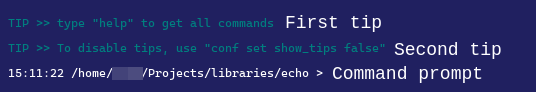
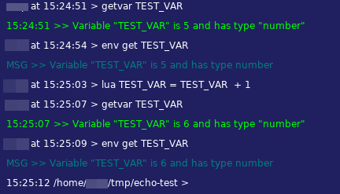
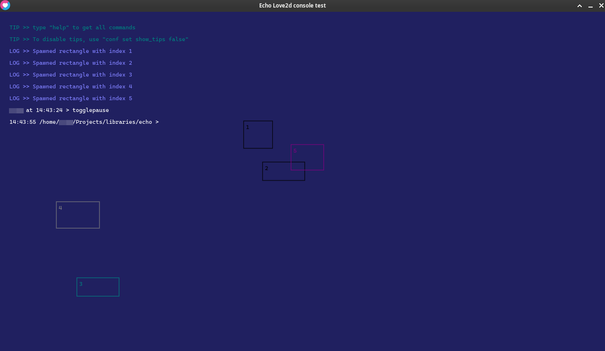

# Echo Console
Echo Console emulates a terminal inside your love2d game. It includes various useful commands, like `getvar` and `setvar`, `lua`, `love`, etc.

## Features
### Sandboxed and protect-called lua code.
When using the `lua` command, or any other that runs lua code, the code is called with `pcall` and has a custom enviroment *(that can be modified with the `env` command)* so you errors in the code don't affect your game.

### Easy implementation
Implementing Echo Console in your project is as easy as writing **6 lines of code** into your `main.lua`:


## Installation
First, clone or add as a submodule:
```bash
git clone https://github.com/Nykenik24/Echo-Console.git path/to/echo
# or, if you have a repository
git submodule add https://github.com/Nykenik24/Echo-Console.git path/to/echo
```
Then, require it in your `main.lua` or the file where you load libraries.
```lua
CONSOLE = require("path.to.echo")
```

### Post installation
After installing echo, you need to actually implement it.

To implement echo into your love project, put this into your `main.lua`:
```lua
function love.load()
	CONSOLE = require("echo") -- see installation
	CONSOLE:init() -- initialize
end

function love.update()
	CONSOLE:update() -- update the console
end

function love.draw()
	CONSOLE:draw() -- draw when open
end

function love.keypressed(k)
	CONSOLE:keypressed(k) -- pass keypresses
end

function love.textinput(t)
	CONSOLE:textinput(t) -- pass text input
end
```
And that's it! You don't need nothing more, echo will handle text input, keypresses, etc. and draw only when open.

## Usage
After doing the steps in [Post installation](#post-installation), run your game and press the grave accent key (`) to open the console

To change this keybind, use `CONSOLE:config("open_keybind", "(new keybind)")` or open the console and type `conf set open_keybind (new keybind)`.

After opening the console, you will see three things:

- Two tips, one saying how to get all commands and one saying how to disable tips.
- The "command prompt", the way you execute commands.


Here you will want to type `help`, as the first tip says, to know what each command does. If you want to know about an specific command, type `help (command)`.

Let's try some commands!

- Type `echo Hello, World!`.
- Type `msg error Goodbye, World!`.
- Type `flexists path/to/echo/init.lua`.
- Type `lua print(2 + 2)`.
- Type `calc 4 * 2 + 6 / 3`.
- Type `env get all` and `getvar all`.
- Type `lua error("this code is sandboxed and protect-called")`.

Now create some global variable called `TEST_VAR` inside your `main.lua` and add it to the enviroment, then link the global variable with the enviroment variable.
```lua
function love.load()
	CONSOLE = require("echo")
	CONSOLE:init()

	TEST_VAR = CONSOLE:setVarInEnv(5, "TEST_VAR")
end

function love.update()
	CONSOLE.utils.linkGlobalToEnvVariable("TEST_VAR", "TEST_VAR")

	CONSOLE:update()
end
-- Other code...
```
Open the terminal and type `getvar TEST_VAR` and `env get TEST_VAR`:



# More
## Demo
The demo consists of `main.lua` and `conf.lua`, to run it use `love`.


### Demo commands
The demo has some unique commands included:

- `spawn` - Spawn a rectangle at `x` *(first arg)*, `y` *(second arg)*.
- `despawn` - Despawns rectangle with index `i` *(first arg)*.
- `randomspawn` - Spawn a rectangle at random position.
- `chspeed` - Changes rectangle speed.
- `togglepause` - Pauses/unpauses the rectangles.

## Credits:
- Demo font: https://github.com/eliheuer/caskaydia-cove
 Configuration
To open echo, press ``